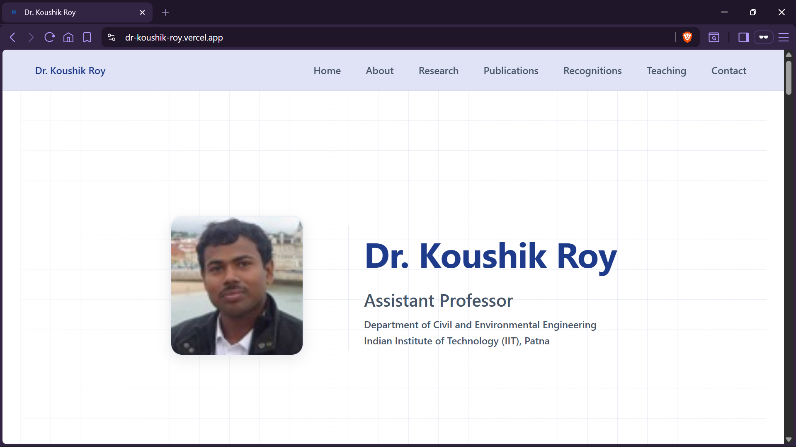

# Faculty Portfolio Website 

A modern, responsive faculty portfolio website built using **React** and **Vite**. The website is designed to present academic and professional information in a clean, organized, and easily maintainable format.

## Preview



## Live Demo

[View the live site](https://dr-koushik-roy.vercel.app/)

## Features

- Hero section with faculty introduction
- Biography and research interests
- Education and professional experience
- Administrative responsibilities
- Current students and alumni
- Publications categorized into:
  - Journal Articles
  - Conference Papers
  - Collapsible year-wise view
- Awards, honours, and professional memberships
- Teaching (Undergraduate & Postgraduate courses)
- Contact information with website links
- Back-to-top button
- Scroll progress indicator
- Responsive design with mobile navigation

## Tech Stack

- React
- Vite
- JavaScript (ES6+)
- CSS3

## Data-Driven Design

The website follows a data-driven architecture, where the UI components are independent of the faculty-specific content. Most updates can be made by editing `facultyData.js` without modifying the React components.

## Project Structure

```
public/
└── kr-logo.png

src/
├── components/
│   ├── ScrollProgress.jsx
│   ├── Navbar.jsx
│   ├── Hero.jsx
│   ├── About.jsx
│   ├── Research.jsx
│   ├── Publications.jsx
│   ├── Recognitions.jsx
│   ├── Teaching.jsx
│   ├── Contact.jsx
│   ├── BackToTop.jsx
│   └── Footer.jsx
├── data/
|   ├── profile-pic.jpg
│   └── facultyData.js
├── styles/
|   ├── global.css
│   └── variables.css
├── App.jsx
└── main.jsx
```

## Customizing Content

All faculty information is stored in:

```text
src/data/facultyData.js
```

To adapt the website for another faculty member:

1. Update `src/data/facultyData.js` with the new information.
2. Replace the profile image at:
   ```text
   src/data/profile-pic.jpg
   ```
3. Update the page title (and favicon, if desired) in `index.html`.

The UI is designed to render the updated information automatically.

## Getting Started

Clone the repository:

```bash
git clone https://github.com/khyati-2010/dr-koushik-roy
cd dr-koushik-roy
```

Install dependencies:

```bash
npm install
```

Start the development server:

```bash
npm run dev
```

Build for production:

```bash
npm run build
```

Preview the production build:

```bash
npm run preview
```

## Deployment

The project can be deployed easily on platforms such as:

- Vercel
- Netlify
- GitHub Pages

The live version of this project is currently deployed on **Vercel**.

---

Developed by **Khyati Aggarwal**